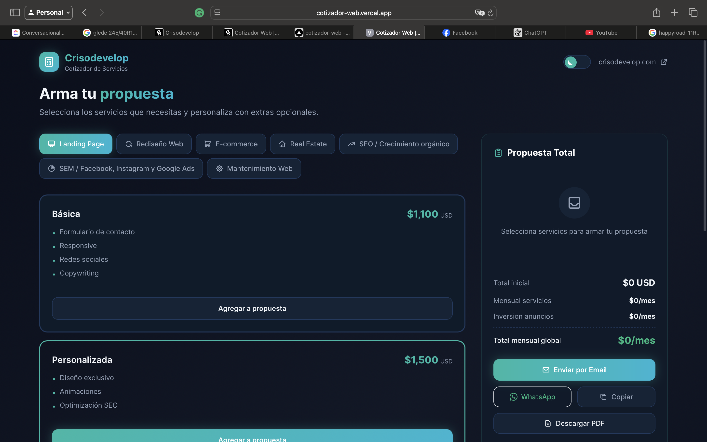

# Cotizador Web - Crisodevelop



## Descripcion

Cotizador interactivo de servicios web desarrollado para **Crisodevelop**. Permite a los clientes armar propuestas personalizadas seleccionando diferentes planes y extras, con calculo automatico de precios y multiples opciones de exportacion.

## Caracteristicas

- **Selector de planes** por categoria (Landing Page, Sitio Web, E-commerce, Real Estate, SEM)
- **Extras personalizables** con precios unitarios o fijos
- **Tema oscuro/claro** con toggle automatico
- **Persistencia local** - los datos se guardan en el navegador
- **Exportacion multiple**:
  - Correo electronico
  - WhatsApp
  - Copiar al portapapeles
  - PDF profesional

## Tecnologias

- **Next.js 14** - Framework React
- **Tailwind CSS** - Estilos utilitarios
- **React Context** - Gestion de estado (temas)
- **html2pdf.js** - Generacion de PDF
- **LocalStorage** - Persistencia de datos

## Instalacion

```bash
# Clonar repositorio
git clone https://github.com/Crisodevelop/Cotizador-WEB.git

# Instalar dependencias
npm install

# Ejecutar en desarrollo
npm run dev

# Construir para produccion
npm run build
```

## Configuracion

Crear archivo `.env.local` en la raiz:

```env
NEXT_PUBLIC_EMAIL=tu-correo@ejemplo.com
```

## Estructura del Proyecto

```
src/
├── app/
│   ├── data/services.js    # Definicion de planes y precios
│   ├── globals.css         # Variables CSS y temas
│   ├── layout.js           # Layout principal
│   └── quote-builder.jsx   # Componente principal
├── components/
│   ├── Header.jsx          # Cabecera con logo
│   ├── Footer.jsx          # Pie de pagina
│   ├── CategoryTabs.jsx    # Tabs de categorias
│   ├── PlanCard.jsx        # Tarjeta de plan
│   ├── AddonsPanel.jsx     # Panel de extras
│   ├── ProposalSidebar.jsx # Sidebar con totales
│   ├── PlanPreview.jsx     # Vista previa del plan
│   ├── PdfDocument.jsx     # Documento PDF
│   └── ThemeToggle.jsx     # Toggle de tema
├── context/
│   └── ThemeContext.jsx    # Contexto de tema
└── hooks/
    └── useLocalStorage.js  # Hook de persistencia
```

## Licencia

Proyecto privado - Crisodevelop

---

Desarrollado por [Crisodevelop](https://crisodevelop.com)
